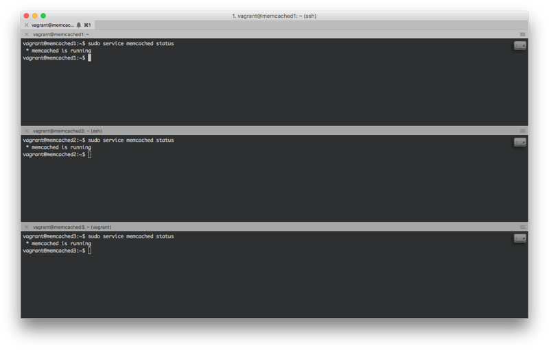
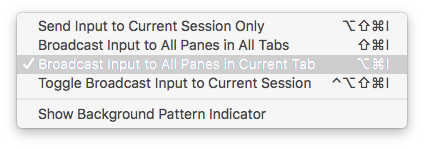

# Широковещательный ввод в iTerm2

В некоторых ситуациях (например, при работе с одинаковыми машинами) бывает удобно раздавать им команды параллельно.
Для этого можно воспользоваться широковещательным вводом:

Включить его можно с помощью меню `Shell -> Broadcast Input`:

